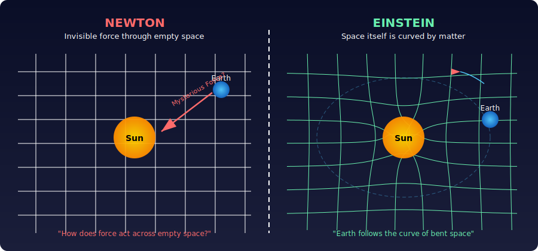
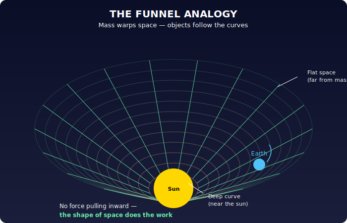
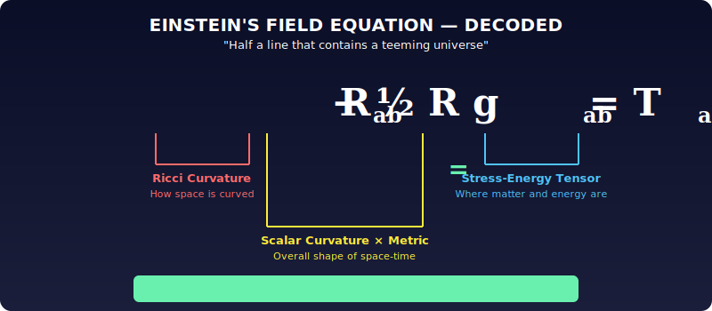
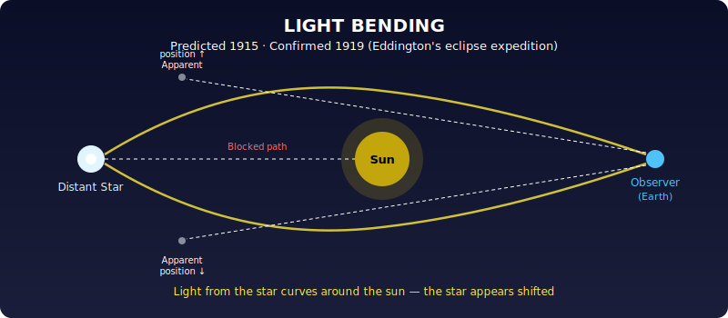
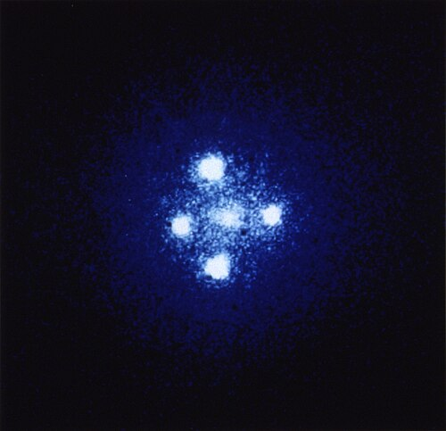
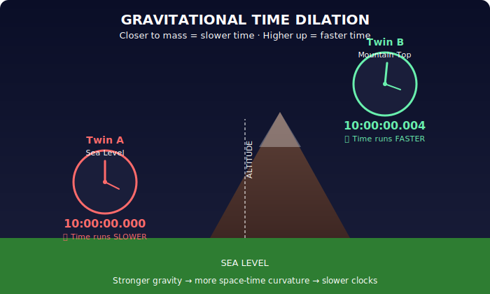
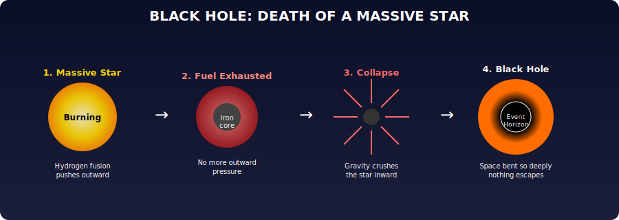
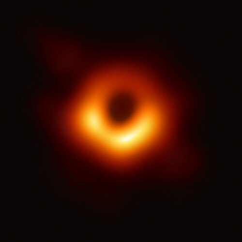
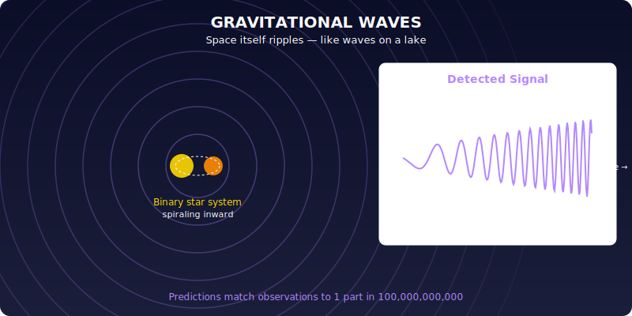

# Chapter 1: The Most Beautiful of Theories

Einstein spent a gap year loafing around Pavia, reading Kant and sitting in on university lectures for fun. Then he enrolled at Zurich's Polytechnic, and in 1905 sent three papers to *Annalen der Physik*, each one Nobel-worthy. The first proved atoms exist. The second planted the seed of quantum mechanics. The third introduced special relativity: time doesn't pass the same for everyone.

But something nagged him. His relativity didn't mesh with gravity, with how things fall. He spent the next decade wrestling with this, and what came out the other end was general relativity.

Here's the core idea.

Newton said gravity is a force between objects, pulling them through an empty container called "space." He couldn't say what space *was*. Then Faraday and Maxwell discovered the electromagnetic field, a real thing, spread everywhere, carrying light and electrical force. Einstein realized gravity must work the same way: there must be a gravitational field.

Then the genius move: **the gravitational field isn't something spread *through* space. It *is* space.** Newton's "space" and the gravitational field are the same thing.

This is general relativity in one sentence. Space isn't a rigid stage, it's a flexible, dynamic material that bends, curves, and twists. The sun warps space around itself, and Earth orbits not because of some invisible force pulling it, but because it's rolling along the curve of warped space, like a marble spiralling in a funnel.

To describe this curvature mathematically, Einstein grabbed a tool built by Bernhard Riemann (a student of Gauss), who had worked out how to describe curved spaces of any dimension. Riemann's curvature is captured by a mathematical object called *R*. Einstein's equation says: R equals the energy of matter. Space curves where there is matter. That's it. Half a line.

$$R_{ab} - \frac{1}{2} R \, g_{ab} = T_{ab}$$

But from that half-line equation pours an insane list of predictions, all confirmed:

---

### Light bending

The sun's gravity curves space enough to deflect light. Predicted by Einstein, measured in 1919 during Eddington's solar eclipse expedition.

Here's what this actually looks like. The **Einstein Cross** (below) shows a single distant quasar whose light is bent by a foreground galaxy into four separate images, exactly as general relativity predicts:

> **Source:** NASA/ESA Hubble Space Telescope · [Wikimedia Commons](https://commons.wikimedia.org/wiki/File:Einstein_cross.jpg) · Public Domain

---

### Time dilation

Time runs faster at higher altitudes, farther from mass. A twin who lived in the mountains is slightly older than one who lived at sea level. Measured and confirmed (GPS satellites have to correct for this every day).

---

### Black holes

When a massive star exhausts its fuel, it collapses and bends space so hard it punches a hole. Once considered theoretical fantasy, now observed by the hundreds.

In 2019, the Event Horizon Telescope captured the first direct image of a black hole, the supermassive black hole at the center of galaxy M87, 55 million light-years away:

> **Source:** Event Horizon Telescope Collaboration, 2019 · [CC BY 4.0](https://creativecommons.org/licenses/by/4.0/) · [Wikimedia Commons](https://commons.wikimedia.org/wiki/File:Black_hole_-_Messier_87_crop_max_res.jpg)

---

### Expanding universe

Einstein's equation says space can't sit still, it must expand. Observed in 1930. Run the expansion backward and you get the Big Bang: the universe exploding from an extremely small, hot state. The leftover glow of that explosion, cosmic background radiation, was found in the sky.

---

### Gravitational waves

Space ripples like the surface of the sea. Predicted by Einstein, detected by LIGO in 2015 from two black holes merging 1.3 billion light-years away. The observations match predictions to a precision of one part in a hundred billion.

---

All of this flows from one intuition: space and gravitational field are the same thing.

That's it. Learning to read it takes effort, but less effort than learning to appreciate a late Beethoven string quartet. And the reward is the same: beauty, and new eyes.

---

*Original: ~18 paragraphs → Unshittified: ~10 paragraphs + 9 diagrams/photos*
