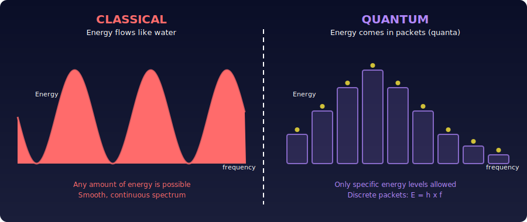
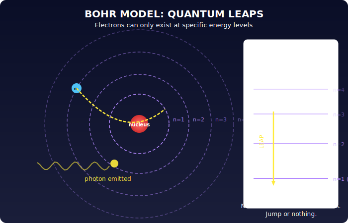
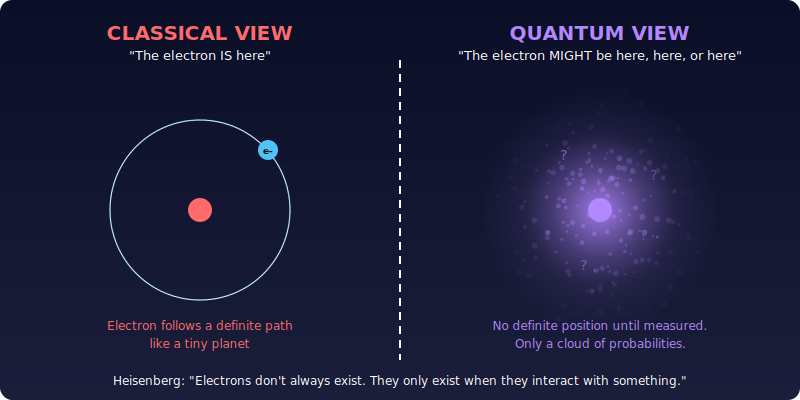
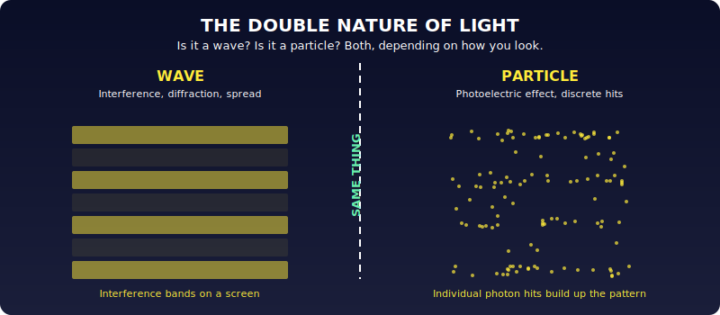
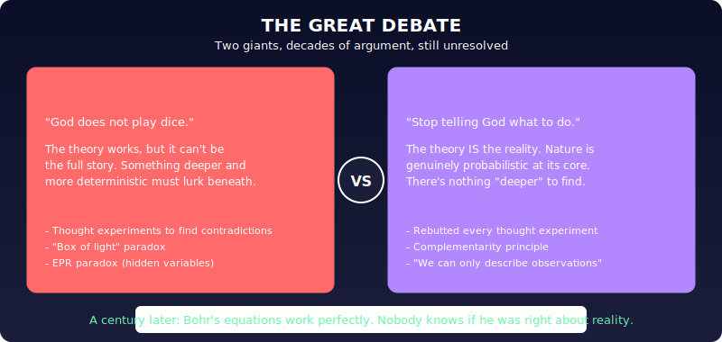
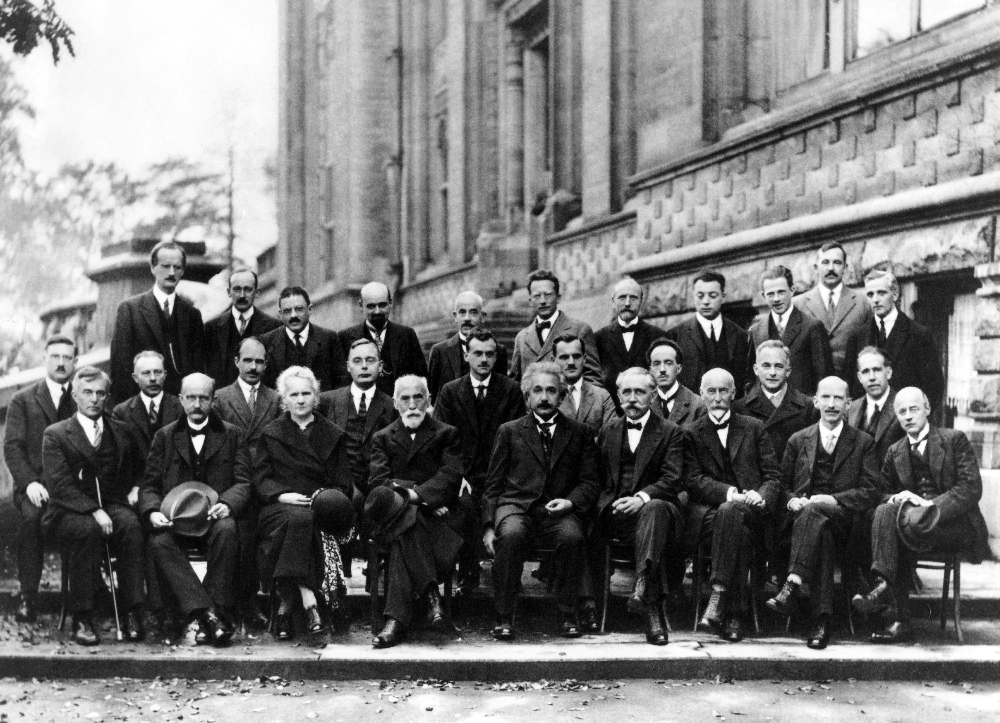

# Chapter 2: Quanta

General relativity is a single, elegant vision from one mind. Quantum mechanics is the opposite: wildly successful, practically transformative (every computer exists because of it), and after a century, still nobody really understands it.

It started in 1900 when Max Planck tried to calculate the energy inside a hot box. To make his math work, he had to pretend energy comes in discrete lumps ("quanta") instead of flowing continuously. The math matched reality perfectly, but the assumption seemed like a hack. Then in 1905, Einstein took it seriously. He proposed that these quanta were real: light is actually made of packets of energy (photons).

He wrote to a friend: "It seems to me that the observations on 'black-body radiation', fluorescence, the photoelectric effect, and other related phenomena are best understood on the assumption that the energy of light is distributed discontinuously in space."

"It seems to me…", the same tentative phrasing Darwin used when introducing evolution, and Faraday when proposing magnetic fields. Genius hesitates.

Niels Bohr ran with it. He figured out that electrons in atoms can only occupy orbits with specific energies, jumping between them by absorbing or emitting a photon: the famous "quantum leaps." Through the 1920s, Bohr's Copenhagen institute became the crucible where the best young physicists hammered these weird observations into a theory. In 1925, the equations arrived and replaced Newton's entire mechanics.

The result was staggering: suddenly you could calculate *everything*. The periodic table? Each element corresponds to one solution of quantum mechanics' main equation. All of chemistry falls out of a single equation.

The key figure was Werner Heisenberg, who proposed something radical: **electrons don't always exist.** They only exist when they interact with something else. Between interactions, an electron isn't in any particular place. It's described by an abstract mathematical formula that lives in mathematical space, not physical space. And when it does show up, where it lands is probabilistic. You can't predict it; you can only calculate the odds.

This has a startling consequence for light too. It behaves as a wave (producing interference patterns) and as a particle (hitting detectors one photon at a time). The individual hits are random, but over thousands of them, they build up the wave pattern. Both descriptions are true simultaneously.

Probability at the foundation of physics. Einstein hated it. He nominated Heisenberg for the Nobel while simultaneously insisting the theory couldn't be right. The Copenhagen group was baffled: their intellectual father, the man who'd already shown time is relative and space is curved, was now saying the world can't be *this* strange.

Einstein and Bohr argued for years, through lectures, letters, thought experiments. Einstein's famous "box of light" experiment tried to show the theory was self-contradictory. Bohr always found a rebuttal. Einstein conceded there were no contradictions, but remained convinced that something more sensible must lurk behind the equations. Bohr insisted this *was* the reality.

The 1927 Solvay Conference brought nearly every major figure in this debate into one room: Einstein, Bohr, Curie, Planck, Heisenberg, Schrödinger, Dirac. This photograph captures the moment quantum mechanics was being forged:

> **Source:** Photo by Benjamin Couprie, 1927 · Public Domain · [Wikimedia Commons](https://commons.wikimedia.org/wiki/File:Solvay_conference_1927.jpg)

A century later, we're still at the same impasse. The equations are used daily by physicists, engineers, chemists, biologists. Modern technology runs on them. But they remain mysterious: they don't describe what happens to a system, they describe how a system affects *another* system. Reality, in quantum mechanics, is interaction. Nothing more.

When Einstein died, Bohr wrote words of admiration. When Bohr died a few years later, someone photographed the blackboard in his study. On it was a drawing of Einstein's light-filled box thought experiment. To the very last: the drive to understand. And to the very last: doubt.

---

*Original: ~14 paragraphs → Unshittified: ~12 paragraphs + 6 diagrams/photos*
