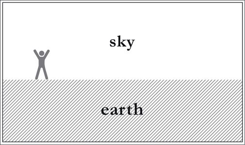
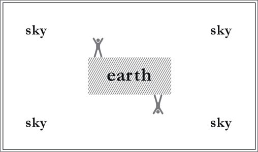
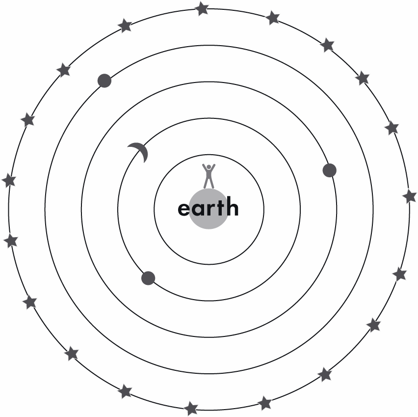
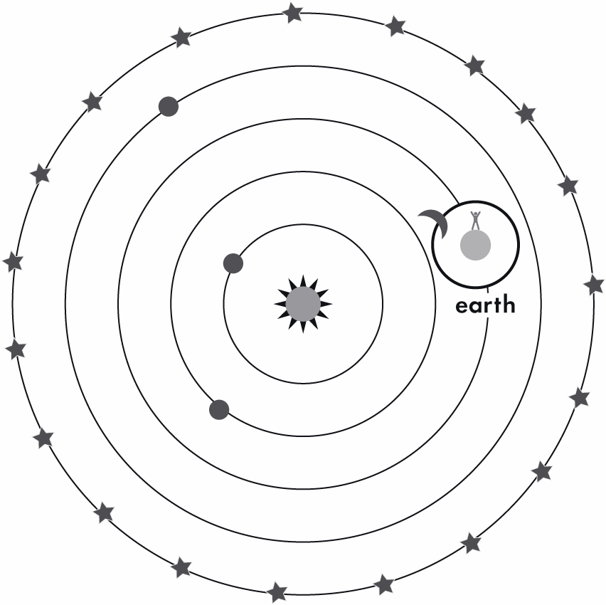
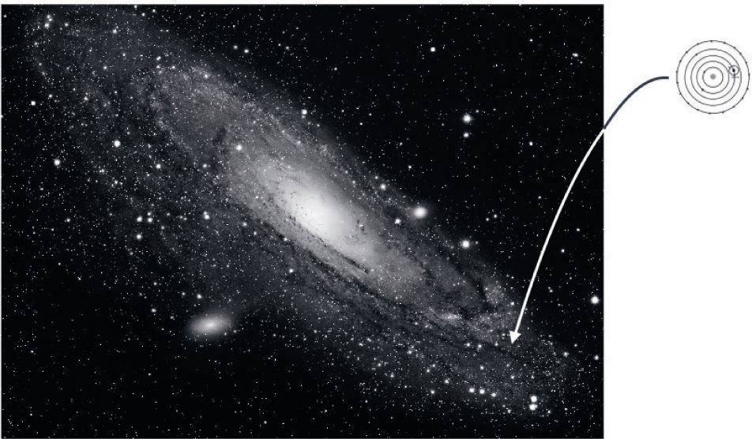
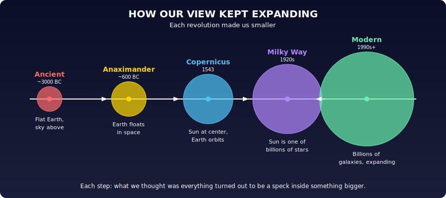
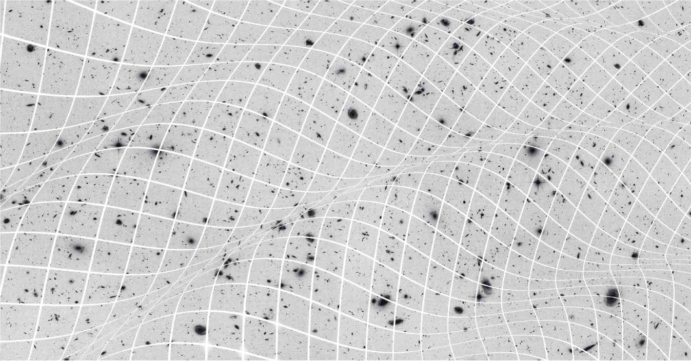
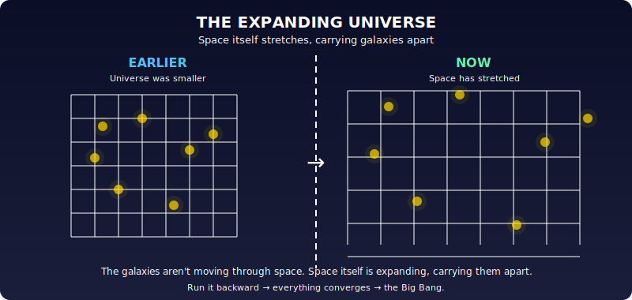
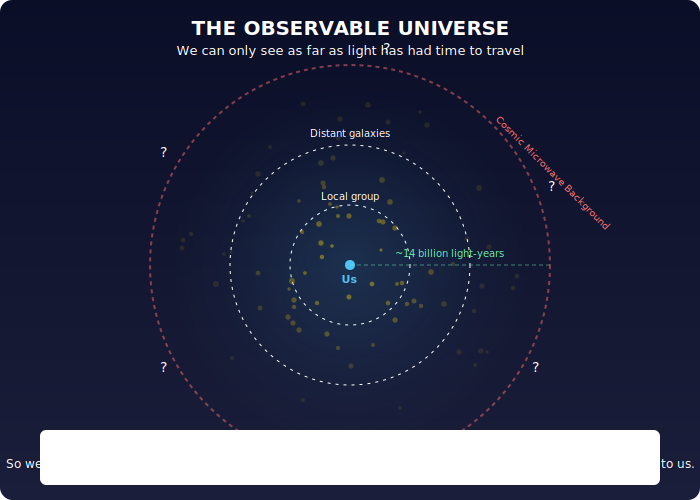
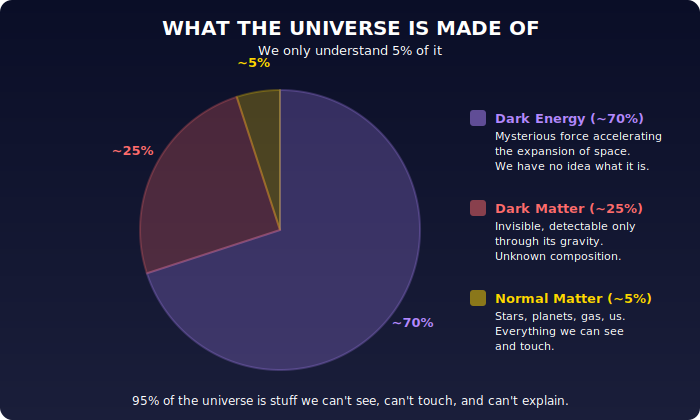

# Chapter 3: The Architecture of the Cosmos

For millennia the picture was simple: Earth below, sky above.

Then Anaximander (~2,600 years ago) realized the sky goes all the way around. Earth floats in space, suspended by nothing. That was the first great cosmological revolution.

For centuries after, the model was Earth at the center with the sun, moon, and stars orbiting around it in concentric spheres, the Aristotelian cosmos that Dante and Shakespeare learned in school.

Copernicus flipped it: the sun sits at the center, Earth is just another planet orbiting it.

Then we realized our sun is one of billions of stars, all belonging to the Milky Way, and our solar system is a tiny speck within it.

Then we discovered the Milky Way is one of billions of galaxies. The universe kept getting bigger, and we kept getting smaller.

A Hubble deep field image of what looks like pure black sky reveals thousands of galaxies in every tiny patch:

> **Source:** NASA/STScI Hubble Space Telescope, 1995 · Public Domain · [Wikimedia Commons](https://commons.wikimedia.org/wiki/File:HubbleDeepField.800px.jpg)

Einstein's general relativity showed that this whole structure, the space containing all these galaxies, isn't static. It expands. And space itself isn't flat, it curves and ripples like the surface of the sea:

Run the clock backward and everything converges to a single, incredibly dense and hot point roughly 14 billion years ago: the Big Bang.

What we can observe is limited. Light has a finite speed, and the universe has a finite age, so we can only see objects whose light has had time to reach us. Our observable universe is a sphere about 14 billion light-years in radius. Beyond that edge, there's more universe, we just can't see it. The cosmic microwave background, the oldest light visible to us, shows us the universe as it was 380,000 years after the Bang, when it first became transparent to light.

The universe is mostly dark. Ordinary matter (stars, planets, us) accounts for only ~5%. Around 25% is "dark matter," detectable through gravity but invisible and of unknown composition. The remaining ~70% is "dark energy," a mysterious force driving the universe's expansion to accelerate. We don't know what either of these are.

So the current picture: space itself expanding, sprinkled with ~200 billion galaxies, bathed in the ancient glow of the Big Bang, made mostly of stuff we can't identify.

---

*Original: ~10 paragraphs → Unshittified: ~10 paragraphs + 12 diagrams/photos*
