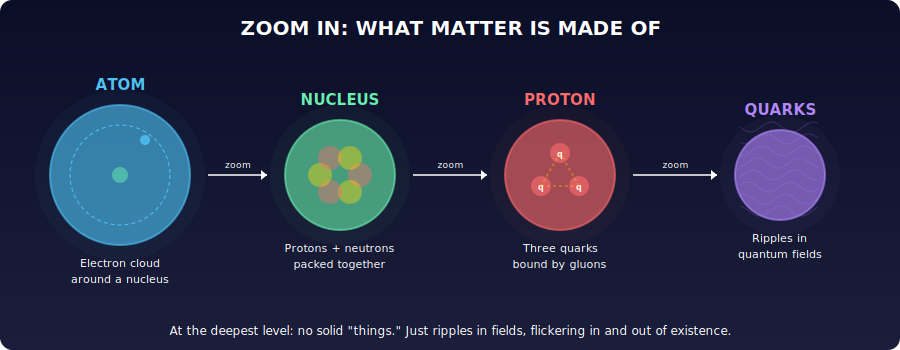
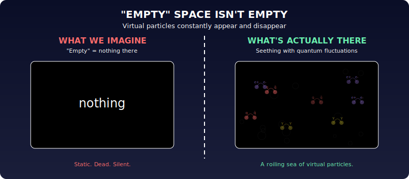
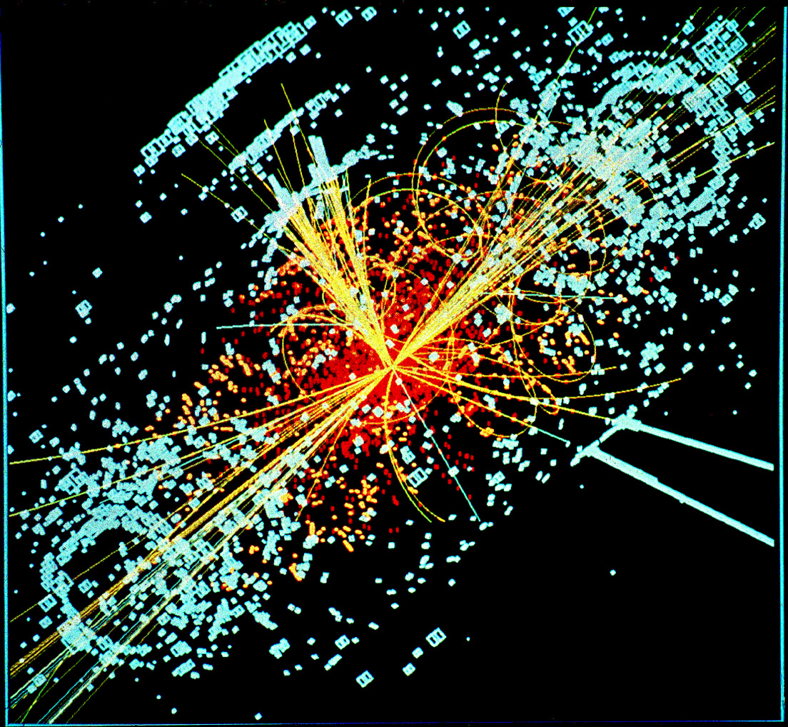

# Chapter 4: Particles

Everything around you is made of a small handful of elementary particles.

**The cast:**
- **Electrons**, orbit atomic nuclei, carry electric current, make chemistry happen.
- **Quarks** (up and down), three quarks bound together make a proton or neutron. These form atomic nuclei.
- **Photons**, packets of light. They carry the electromagnetic force.
- **Gluons**, carry the strong force that glues quarks together inside protons and neutrons. (Yes, physicists named them "gluons.")
- **Neutrinos**, swarm everywhere, interact with almost nothing.
- **Higgs bosons**, detected at CERN in 2012; responsible for giving particles their mass.

That's basically it. Fewer than ten types. A tiny Lego set that builds everything: galaxies, mountains, you.

But what are these particles, really? They're not little pebbles. They're "quanta" of underlying fields, just like photons are quanta of the electromagnetic field. They're ripples in the fabric of reality, appearing, disappearing, and flickering in and out of existence according to the rules of quantum mechanics.

Even "empty" space isn't truly empty: it seethes with tiny fluctuations, particles briefly popping into and out of existence.

This is the **Standard Model of particle physics**. It was built through the 1950s-70s by physicists like Feynman and Gell-Mann. Its final piece, the Higgs boson, was confirmed at CERN in 2012. The image below is what a Higgs boson event actually looks like in the CMS detector: a firework of particle tracks exploding from the collision point:

> **Source:** CERN/CMS Collaboration · CC-BY-SA 4.0 · [Wikimedia Commons](https://commons.wikimedia.org/wiki/File:CMS_Higgs-event.jpg)

Every prediction has been verified. But physicists don't love it. The Standard Model works, but it feels like a patchwork. Why *these* particles? Why *these* forces? Why *these* particular values for the constants? There's no underlying principle that makes it feel inevitable. Worse, the equations are mathematically ugly: used directly, they predict infinite values, and you have to use a convoluted trick called "renormalization" (essentially cancelling infinities with other infinities) to get sensible answers. It works, but it stinks.

There are also known gaps:
- **Dark matter**: we can see its gravitational effects around galaxies, but it's not made of anything in the Standard Model. We don't know what it is.
- **Gravity**: the Standard Model doesn't include it. Gravity lives in general relativity, a completely separate framework.

Attempts to improve the situation keep failing. SU5, an elegant theory from the 1970s, predicted proton decay. Giant detectors watched tonnes of water for years. No proton ever decayed. Dead theory. "Supersymmetric" theories predicted new particles. Decades of searching at particle accelerators. Nothing found.

So the Standard Model stands: inelegant, incomplete, and the best description of matter we have.

---

*Original: ~14 paragraphs → Unshittified: ~9 paragraphs + 4 diagrams/photos*
