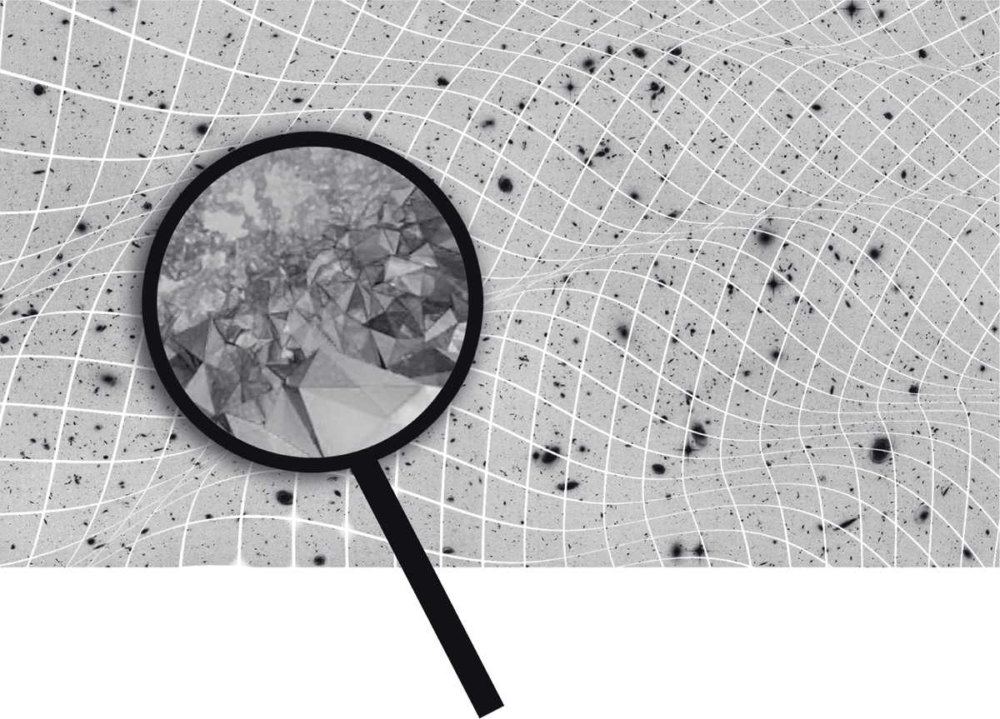
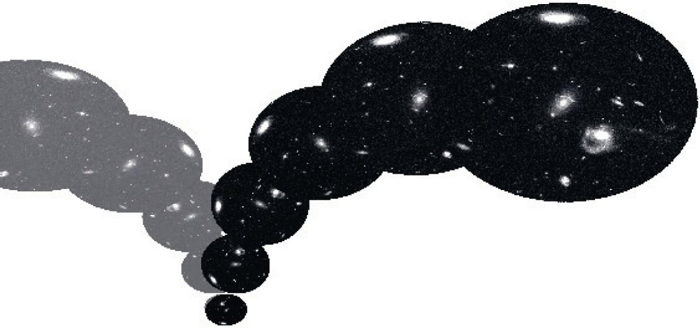

# Chapter 5: Grains of Space

General relativity says space is a smooth, bendable fabric. Quantum mechanics says every field is made of discrete grains. Put these together and the conclusion is immediate: **space itself must be granular.** Not infinitely divisible, but made of tiny atoms of space.

This is the core idea of **loop quantum gravity**, an attempt to unify general relativity and quantum mechanics using only ideas already contained in both theories, without bolting on new assumptions.

The theory says these atoms of space are absurdly small, a billion billion times smaller than an atomic nucleus. They're called "loops" because they link to each other in a network, weaving the texture of space like an immense chain mail. And they're not *in* space, they *are* space. Space is the network of their connections.

The second consequence is even more extreme: **time disappears from the fundamental equations.** The equations describing grains of space and matter don't contain a time variable. This doesn't mean nothing changes, it means change is everywhere, but there's no single universal clock. Each process dances to its own rhythm, independently of its neighbors. Time, as we experience it, emerges from the relationships between quantum events, not from some external metronome.

So at the deepest level: no container called "space," no river called "time." Just elementary processes, quanta of space and matter interacting. The smooth space and flowing time we experience are blurred, zoomed-out approximations, like how a calm lake is actually trillions of molecules vibrating.

**What about evidence?** The theory makes testable predictions, though none are confirmed yet:

- **Black holes and Planck stars.** When a star collapses into a black hole, loop quantum gravity says the matter can't crush to an infinitely small point (infinitely small points don't exist). Instead it compresses to an "atom-sized" remnant called a Planck star, then bounces back. The bounce happens fast from the star's perspective, but extreme time dilation makes it look like the black hole persists for eons from the outside. A black hole is a rebounding star viewed in extreme slow motion. If primordial black holes exist, we might detect their explosions as high-energy cosmic rays.

- **The Big Bounce.** Run the universe's expansion backward and general relativity says it all crunches to a single point, a singularity. Loop quantum gravity says no: at extreme compression, quantum effects create a repulsive force. The Big Bang was actually a Big Bounce from a prior contracting universe. At the bounce point, space and time dissolved entirely into a cloud of quantum probability that the equations can still describe.

---

*Original: ~16 paragraphs → Unshittified: ~7 paragraphs*
