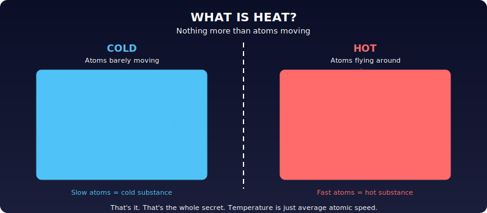
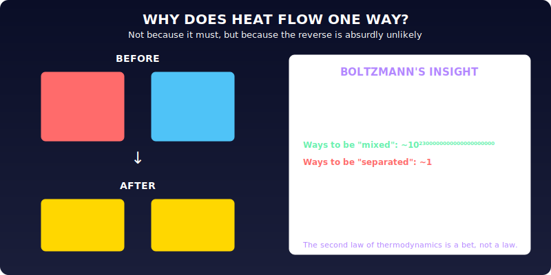
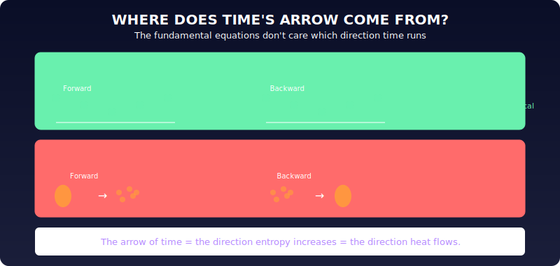
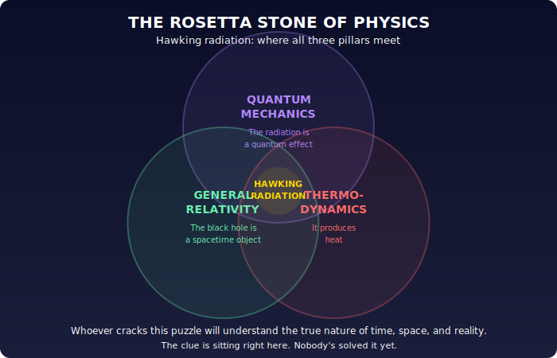

# Chapter 6: Probability, Time, and the Heat of Black Holes

This chapter is about a different pillar of physics, one that started with a simple question: **what is heat?**

Until the mid-1800s, physicists thought heat was a fluid ("caloric"). Maxwell and Boltzmann figured out the truth: a hot substance is one where atoms move faster. Cold = slow atoms. Hot = fast atoms. That's it.

But then: **why does heat always flow from hot to cold, never the reverse?**

This matters because it's connected to time itself. In every situation where heat isn't involved, physics is time-reversible (planetary orbits, bouncing balls in a vacuum, the equations all work identically forward and backward). The moment heat enters the picture, the future becomes different from the past. Heat flowing from hot to cold is what gives time its direction.

Boltzmann's answer: it's not that heat *can't* flow from cold to hot. It's just astronomically unlikely. A hot object in contact with a cold one *could* spontaneously get hotter while the cold one gets colder, but the probability is so vanishingly small it never happens in practice. The second law of thermodynamics (entropy increases) isn't a law about what's forbidden. It's a law about what's overwhelmingly probable.

This connects heat to **probability**, and probability to a deeper insight: the reason we see probabilistic behavior is that we can't track the fine-grained details of reality. We see averages, blurred summaries, not the exact motion of every atom. The arrow of time isn't baked into the fundamental equations. It emerges from our coarse-grained view.

Now apply this to gravity. The gravitational field *is* space-time (Chapter 1). Like any field, space-time should have thermal properties. It should be able to be "hot." But we don't yet have equations to describe the thermal vibrations of space-time itself. What does it mean for time to vibrate?

This leads to the deepest question: **what is the flow of time?**

Physics describes how things change as a function of time, but time itself has no special status in the equations, no more than position or any other variable. Time *seems* to flow, but "now" is just as subjective as "here." No one says things that are "here" exist while things that aren't "here" don't. Yet we say the present exists and the past and future don't. Why?

Special relativity made this worse: there's no universal "now." Two people moving at different speeds can't agree on what's simultaneous. Einstein wrote after his friend Michele Besso died: "People like us, who believe in physics, know that the distinction made between past, present and future is nothing more than a persistent, stubborn illusion."

So where does our vivid experience of time flowing come from? The answer seems to lie in the connection between time, heat, and probability. There's a detectable difference between past and future only when heat flows. Heat is linked to probability. Probability is linked to our inability to see the fine details. **The flow of time emerges from thermodynamics, not from fundamental physics.** For a hypothetical being that could track every particle, there would be no "flowing" of time, just one block of past, present, and future. We perceive time flowing because our consciousness only grasps a blurred, statistical view of reality.

The three pillars (quantum mechanics, general relativity, and thermodynamics) need to be unified, and we don't know how yet. But there's a clue.

**Hawking radiation.** Stephen Hawking showed mathematically that black holes are hot. They emit thermal radiation. This hasn't been directly observed (the radiation is extremely faint), but the calculation is widely accepted. The source of the heat: the individual quanta of space, the granular atoms of space from Chapter 5, vibrating at the black hole's surface.

This is the Rosetta Stone of physics. Black hole heat involves all three pillars simultaneously: quantum mechanics (the radiation is a quantum effect), general relativity (the black hole is a gravitational object), and thermodynamics (it's heat). Deciphering how these three languages fit together in this one phenomenon may reveal the true nature of time.

---

*Original: ~20 paragraphs → Unshittified: ~13 paragraphs + 4 diagrams*
