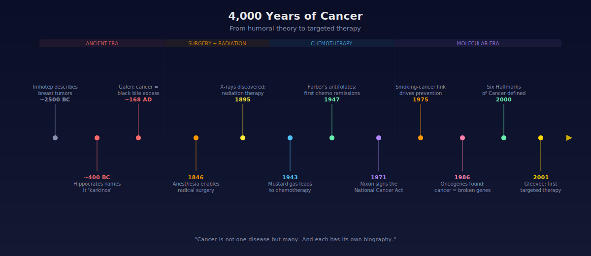
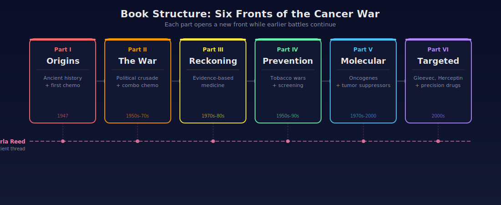
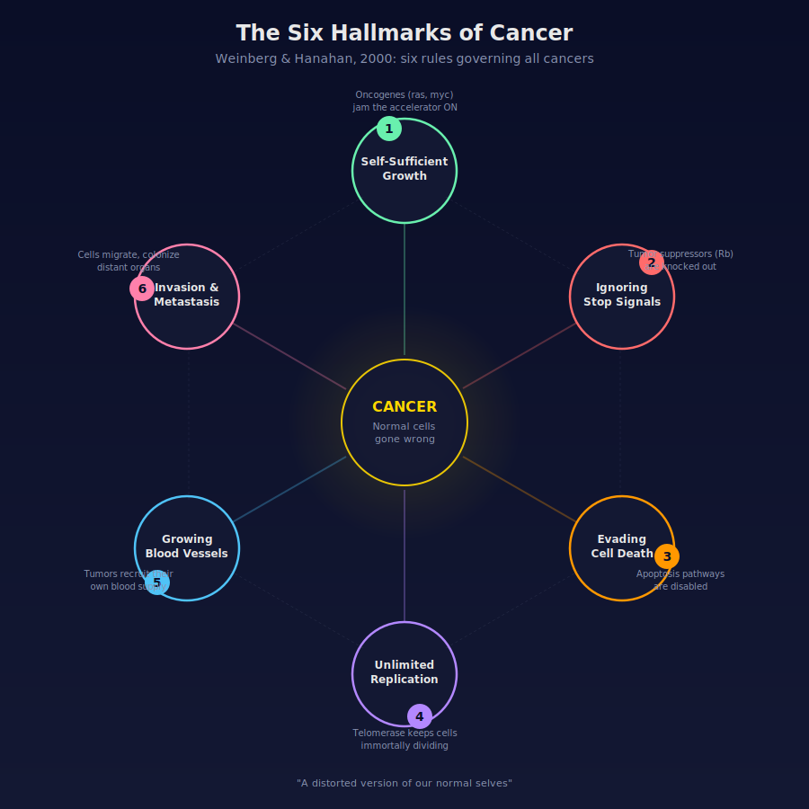

# The Emperor of All Maladies
**Author:** Siddhartha Mukherjee

## What This Book Is About
4,000 years of humanity trying to kill a disease that turned out to be a distorted version of ourselves.

## Book Structure

The book attacks cancer on six fronts, each building on the last. A present-day patient thread (Carla Reed's leukemia treatment) runs underneath, connecting history to the reality of modern oncology.

## Chapter Map

### Part One: "Of blacke cholor, without boyling"
*How chemotherapy was born, and how cancer went from invisible to America's #2 killer.*

1. **Prologue** — A pathologist in a Boston basement decides to inject dying children with an experimental chemical. The first attempt to treat cancer with drugs.
2. **"A monster more insatiable than the guillotine"** — Cancer rises as other diseases fall. A national institute is created to fight it, then immediately sidelined by WWII. Cancer becomes the disease nobody talks about.
3. **Farber's Gauntlet** — The first chemo trials. Kids go into remission for the first time in history. Then relapse. The medical establishment is furious.
4. **A Private Plague / Onkos** — Cancer's ancient history: Egyptian papyri, Greek physicians, 2,000 years of wrong theories about "black bile." Where the word "cancer" comes from (Greek for crab).
5. **Vanishing Humors / A Radical Idea** — Surgery takes over. A surgeon invents a procedure to cut away as much tissue as possible: more cutting, more curing. This logic dominates for a century.
6. **Dyeing and Dying / Poisoning the Atmosphere** — X-rays, the "magic bullet" concept, and mustard gas: WWI/WWII battlefield poison accidentally reveals that chemicals can kill cancer cells.
7. **The House That Jimmy Built** — Farber reinvents himself as a fundraiser and political operator. Allies with the most powerful medical lobbyist in American history.

### Part Two: An Impatient War
*The political crusade for a national war on cancer, and the combinatorial chemotherapy revolution.*

8. **"They form a society"** — Cancer becomes a political cause. Lobbyists push Washington to declare war.
9. **"These new friends of chemotherapy"** — A doctor cures a rare cancer with chemo alone, the first true cure. He gets fired for it because he kept treating patients after their tumors disappeared.
10. **An Early Victory / VAMP** — Researchers learn to combine multiple drugs at once. Childhood leukemia starts getting real, lasting cures. The principle: overwhelm the cancer before it can adapt.
11. **An Anatomist's Tumor** — Clinical trials prove that less surgery works just as well as radical surgery. The century-old "cut more" dogma begins to crumble.
12. **"A moon shot for cancer"** — The National Cancer Act, 1971. $1.5 billion pledged. Scientists warn it's premature. The political champions withdraw, exhausted. Farber dies in 1973.

### Part Three: "Will you turn me out if I can't get better?"
*The reckoning: did the War on Cancer actually work? The rise of evidence-based oncology.*

13. **"In God we trust. All others [must] have data"** — The randomized clinical trial becomes the gold standard. Statistics replace intuition.
14. **"The smiling oncologist"** — The tension between aggressive treatment and quality of life. What chemo can and can't do.
15. **Halsted's Ashes / Counting Cancer** — Landmark trials finally prove: a small surgery plus radiation equals a radical surgery in outcomes. "More is better" dies as surgical dogma.

### Part Four: Prevention Is the Cure
*Tobacco, screening, and the second front: stopping cancer before it starts.*

16. **"Coffins of black" / The Emperor's Nylon Stockings** — Epidemiologists prove smoking causes lung cancer. Two independent teams reach the same conclusion. The tobacco industry fights back with manufactured doubt.
17. **"A thief in the night" / "A spider's web"** — Pap smears, mammography, cervical cancer screening. Prevention and early detection become real weapons.
18. **STAMP** — The bone marrow transplant revolution and its dark side: high-dose chemo for breast cancer becomes a craze, then a cautionary tale of hope outrunning evidence.
19. **The Map and the Parachute** — An honest accounting: cancer mortality barely budged from 1970-1994. But the flat line hides a fierce tug-of-war underneath, gains in some cancers perfectly offset by losses in others.

### Part Five: "A Distorted Version of Our Normal Selves"
*The molecular revolution: what cancer actually IS at the genetic level.*

20. **Under the Lamps of Viruses** — A virus that causes cancer in chickens kicks off decades of hunting for human cancer viruses. The search fails, but accidentally leads to a bigger discovery.
21. **"The hunting of the sarc"** — The first cancer gene is found. The stunning punchline: cancer genes are mutated versions of our own normal genes. Cancer isn't an invader. It's us, broken.
22. **A Risky Prediction** — The discovery of "brake" genes that normally stop cell growth. Cancer needs both accelerators jammed on AND brakes knocked out.
23. **The Hallmarks of Cancer** — A landmark paper distills all cancers into six shared biological rules.

### Part Six: The Fruits of Long Endeavors
*Targeted therapy: drugs designed for specific molecular locks.*

24. **New Drugs for Old Cancers** — Understanding one specific broken protein leads to a drug built to fit it like a key. The poster child for targeted therapy.
25. **Drugs, Bodies, and Proof** — The new model: match drugs to molecular subtypes, not tumor locations.
26. **The Red Queen's Race** — Cancer evolves resistance. Targeted therapies work brilliantly, then fail. You have to keep running just to stay in place.
27. **Atossa's War** — Can cancer ever be "conquered"? Or is it woven into the fabric of multicellular life itself?

---

*Original overview: 31 entries → Unshittified: 27 chapters, grouped by part*
