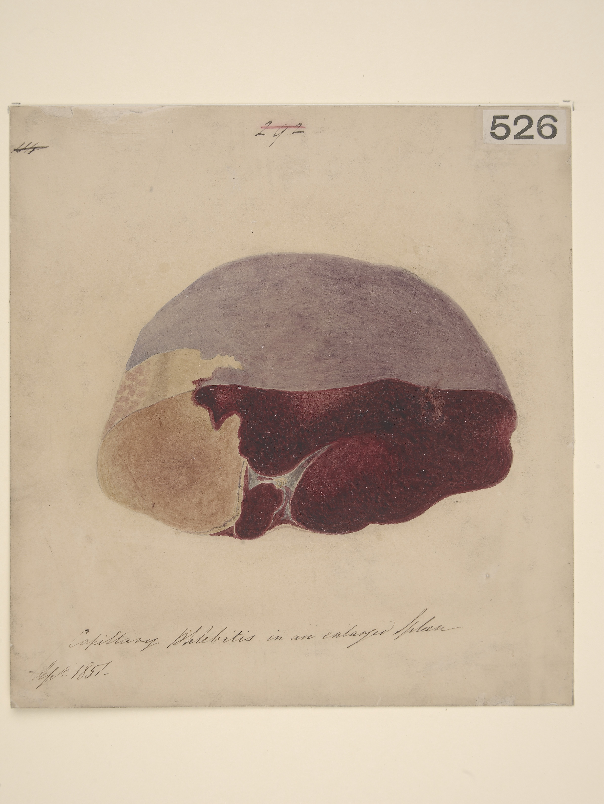
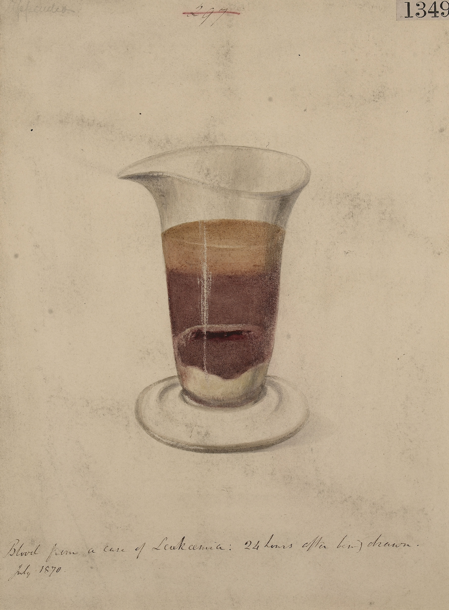
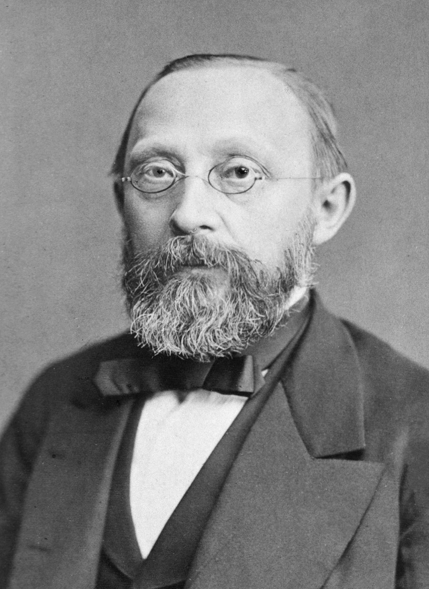
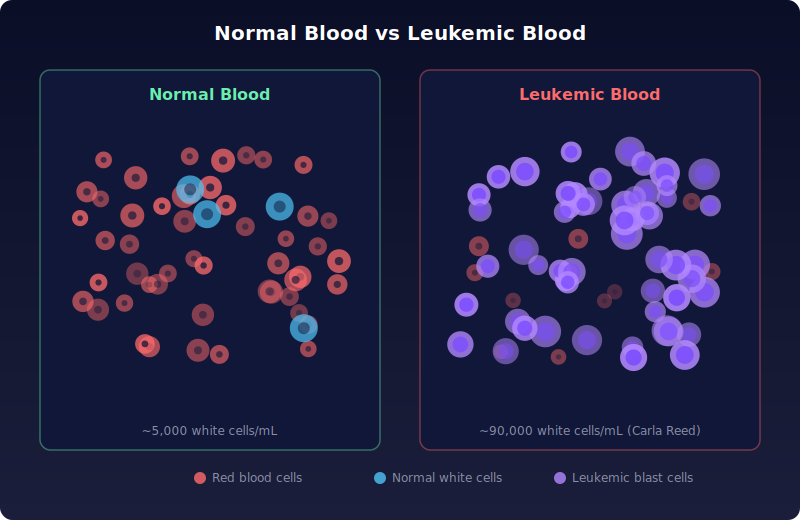
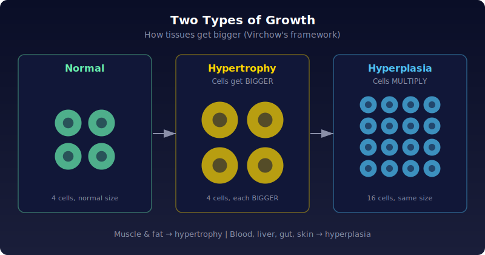
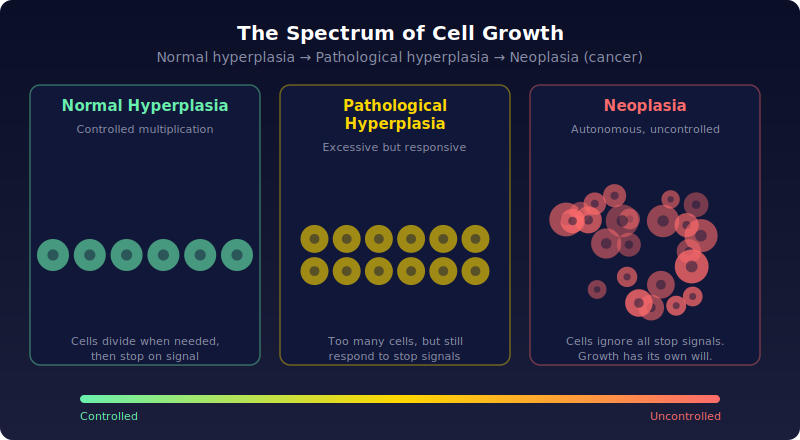
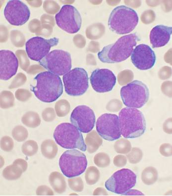
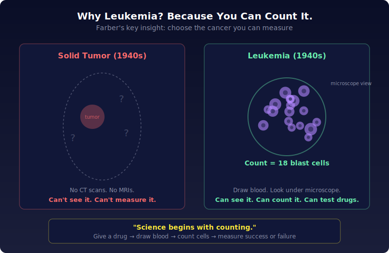

# Chapter 1: Prologue — "A Suppuration of Blood"

In 1947, every child diagnosed with leukemia died. Not most. Every single one. The standard treatment was: diagnose, transfuse, send home to die. The entire medical profession had collectively shrugged.

One man decided to try anyway. Sidney Farber was a pathologist, a "doctor of the dead," who'd spent twenty years in a basement at Boston's Children's Hospital dissecting corpses and staring through microscopes. He had never treated a living patient. That December, he tore open a parcel from New York containing vials of a yellow chemical called aminopterin, and started injecting it into dying children.

## The disease nobody could touch

<table><tr>
<td width="55%" style="vertical-align: top; padding-right: 20px;">

Leukemia had fascinated doctors for over a century. The textbooks were packed with exquisite photographs of leukemia cells, elaborate taxonomies, page after page of classification. All of it useless. As one oncologist recalled, the research "gave physicians plenty to wrangle over at medical meetings, but it did not help their patients at all." A patient with acute leukemia was diagnosed, transfused, and sent home to die.

</td>
<td width="45%" style="vertical-align: top;">

 <b>Ehrlich & Lazarus's textbook plate:</b> beautifully drawn, meticulously classified, therapeutically worthless. · <a href="https://commons.wikimedia.org/wiki/File:Case_of_acute_leukaemia;_Ehrlich_%26_Lazarus_Wellcome_M0013297.jpg">Wellcome Collection, CC BY 4.0</a>

</td>
</tr></table>

<table><tr>
<td width="55%" style="vertical-align: top; padding-right: 20px;">

The confusion started at the very beginning. In 1845, a Scottish doctor drew blood from a man with a massively swollen spleen and found it thick with white cells. White cells normally mean infection, like pus from a wound, so he figured the blood had somehow gone bad on its own. He called it "a suppuration of blood." Reasonable guess, except the patient had no infection at all. The blood just looked that way. Nobody knew why.

</td>
<td width="45%" style="vertical-align: top;">

 <b>1857:</b> An enlarged spleen, painted from a pathology specimen. In leukemia, spleens balloon as white cells pile up with nowhere to go. · <a href="https://commons.wikimedia.org/wiki/File:Enlarged_spleen_with_a_partially_decolourised_infarct_Wellcome_L0062845.jpg">Wellcome Collection, CC BY 4.0</a>

</td>
</tr></table>

<table><tr>
<td width="55%" style="vertical-align: top; padding-right: 20px;">

Four months later, a young German researcher named Rudolf Virchow saw a strikingly similar case: a cook in her fifties, white cells so thick in her blood that pathologists could see the milky layer floating above the red without even needing a microscope.

</td>
<td width="45%" style="vertical-align: top;">

 <b>July 1870:</b> Leukemic blood 24 hours after being drawn. The thick milky-white layer of white cells sits visibly on top of the red. This is what Virchow saw. · <a href="https://commons.wikimedia.org/wiki/File:Blood_from_a_case_of_leukaemia_Wellcome_L0062507.jpg">Wellcome Collection, CC BY 4.0</a>

</td>
</tr></table>

> **Source:** National Library of Medicine · Public Domain · [Wikimedia Commons](https://commons.wikimedia.org/wiki/File:Rudolf_Virchow_NLM3.jpg)

Virchow didn't buy the "spontaneous pus" theory. Blood doesn't just spoil. Instead of pretending to understand the disease, he simply described what he saw: *weisses Blut*, white blood. In 1847 he switched to the Greek: *leukemia*, from *leukos*, white.

That might seem like just a name change, but it mattered enormously. Naming a disease after a wrong explanation ("suppuration of blood") locks everyone into the wrong framework. Naming it after an observation ("white blood") clears the slate. A disease at the moment of its discovery is a fragile idea, deeply influenced by its first label. (More than a century later, renaming "gay-related immune disease" to "acquired immunodeficiency syndrome" would signal the same kind of conceptual breakthrough.)

## Virchow's insight: cells making cells making cells

Virchow went far beyond naming leukemia. He launched a project that would reshape medicine: describing all human disease in terms of cells.

In the 1840s, medicine was still haunted by invisible forces: miasmas, bad humors, hysterias. Virchow focused on what he could actually see. Building on the recent discovery that all living things are made of cells, he proposed two foundational rules:

1. Human bodies are made of cells.
2. Cells only come from other cells. (*Omnis cellula e cellula.*)

From these two rules, he derived something powerful. Growth can only happen two ways:

**Hypertrophy**: cells get bigger. Like inflating a balloon. Muscle and fat typically grow this way.

**Hyperplasia**: cells multiply. The liver, blood, gut, and skin grow this way: cells becoming cells becoming more cells.

Both kinds of growth can go wrong. A heart forced to pump against a blocked valve will enlarge each muscle cell to generate more force, eventually growing so overgrown it can barely function: pathological hypertrophy.

And then there was the quintessential disease of pathological hyperplasia. Looking at cancerous growths through his microscope, Virchow saw cells multiplying without restraint, as if possessed by some new drive. He called it **neoplasia**: new, distorted growth. A word that would echo through the entire history of cancer.

By Virchow's death in 1902, the picture had come together. Cancer was pathological hyperplasia, cells dividing uncontrollably, forming tumors that invade organs and spread to distant sites (metastases). Every cancer, from breast to brain to blood, shared this same core feature: uncontrolled cell division.

And leukemia? Not a "suppuration of blood." It was neoplasia of blood. Cancer in a molten, liquid form.

## Two faces of leukemia

By the early 1900s, doctors recognized that leukemia came in distinct personalities. It could be **chronic**: slow, smoldering, gradually choking the bone marrow, as in Virchow's original case. Or **acute**: violent, explosive, with fevers, sudden bleeding, and dazzlingly fast cell overgrowth.

The acute form split further by cell type. White blood cells come in two main lineages: myeloid and lymphoid. Acute myeloid leukemia (AML) was cancer of the myeloid line. Acute lymphoblastic leukemia (ALL) was cancer of immature lymphoid cells. In children, it was almost always ALL, and it was almost always fatal within days.

## Carla

The book's present-day thread begins with a patient named Carla Reed. An adult with ALL. Her numbers were staggering: ninety thousand white cells per milliliter of blood, nearly twenty times normal. Ninety-five percent of them were blasts, malignant lymphoid cells produced at a frenetic pace but stuck in immaturity, unable to do the job white cells are supposed to do: fight infection. She had immunological poverty in the face of plenty.

> **Source:** Wikimedia Commons · Public Domain · [File:Acute leukemia-ALL.jpg](https://commons.wikimedia.org/wiki/File:Acute_leukemia-ALL.jpg)

Her bone marrow, normally an organized organ that manufactures blood, was obliterated. Sheet after sheet of malignant blasts had packed the marrow space, destroying all architecture, leaving no room for normal blood production. Her red cells had dropped so low her blood couldn't carry enough oxygen (the headaches were the first sign). Her platelets had collapsed to near zero, which explained the bruises.

Treatment would require pushing her *deeper* into the abyss before pulling her out. Chemotherapy would kill the leukemia, but it would also destroy whatever normal blood cells remained. The only way out was through.

## Why leukemia? Because you can count it.

Farber was a formal, meticulous man (his colleagues at Harvard nicknamed him "Four-Button Sid" for the suits he wore to class). He trained in pathology, mastered the field, wrote the definitive textbook on postmortem examination. But by 1947, he wanted to do something no pathologist did: treat cancer with chemicals.

He chose leukemia for one elegant reason: it could be measured.

Science begins with counting. To understand something, you measure it. But in the 1940s, without CT scans or MRIs, you couldn't measure a tumor buried inside the lung or breast without cutting someone open. Solid tumors were invisible.

Leukemia was different. It floated freely in the blood. You could draw a blood sample, look under a microscope, and count the cancer cells directly. If you gave a patient a drug, you could watch the cells rise or fall. You could run an experiment on cancer.

From this simple, measurable disease, Farber planned to extrapolate into the more complex world of solid tumors. The bacterium would teach him about the elephant. As he tore open the parcel from New York that December morning and pulled out the glass vials of aminopterin, he was opening an entirely new way of thinking about cancer.

---

*Original: ~84 paragraphs → Unshittified: ~35 paragraphs*
