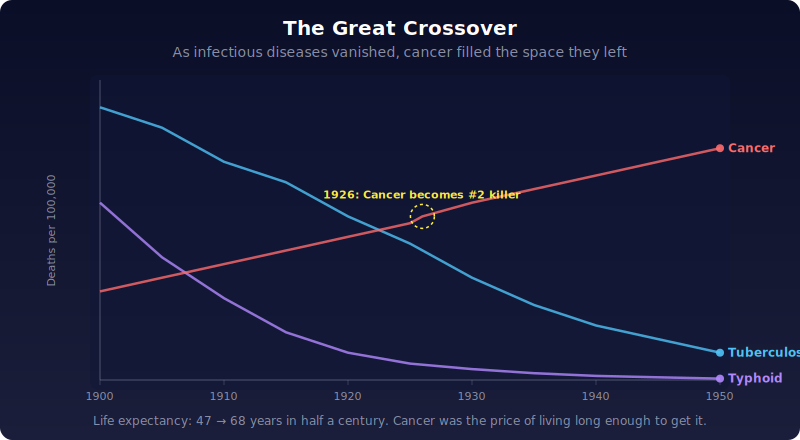
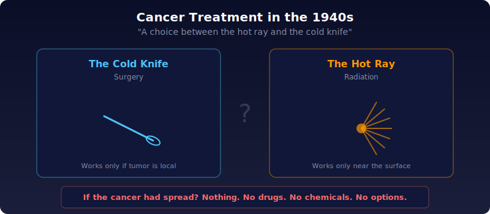
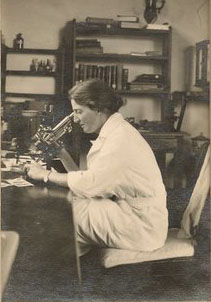
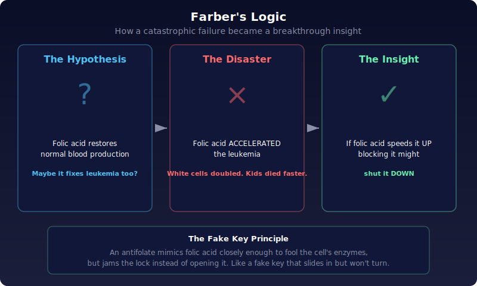
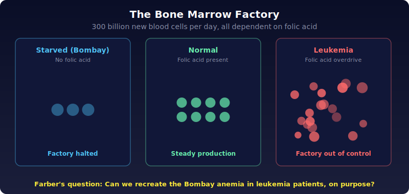
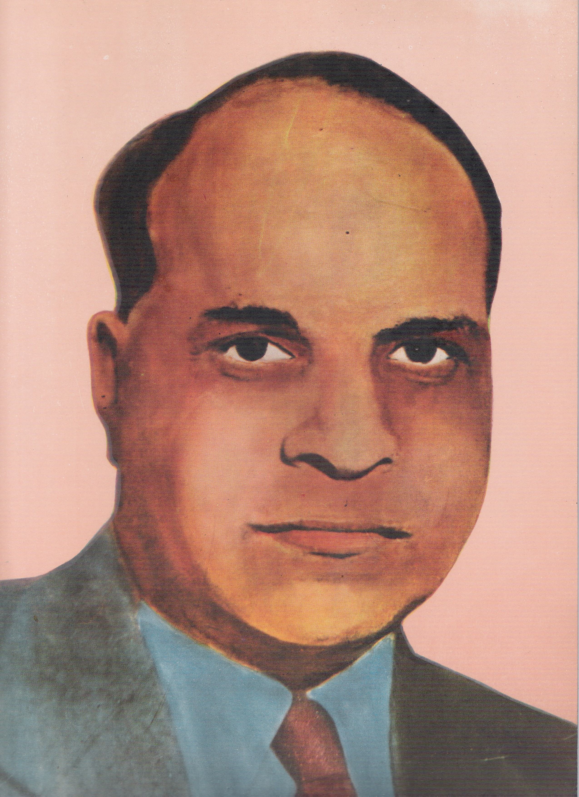

# Chapter 2: "A Monster More Insatiable Than the Guillotine"

## Medicine was winning everything except cancer

Farber's chemicals arrived at the exact moment when medicine felt invincible. Penicillin, which had been so scarce during WWII that doctors recovered it from patients' urine, was now being mass-produced so cheaply it cost less than a glass of milk. New antibiotics were dropping every year: chloramphenicol in 1947, tetracycline in 1948. Polio vaccines were being developed down the hall from Farber's own lab at Children's Hospital. American life expectancy jumped from 47 to 68 in half a century.

Typhoid had been wiped out by clean water. Tuberculosis was collapsing. The public expected cures for everything. In the new suburban developments, "illness" ranked only third on lists of worries, behind money and raising kids. America was having a baby every seven seconds and buying boat-size Studebakers. Death felt optional.

Cancer didn't get the memo.

## The disease that climbed as others fell

If a tumor sat in one spot, a surgeon could cut it out. If it was near the surface, radiation could burn it. That was it. Two options: the hot ray or the cold knife. No drugs, no deeper understanding. In 1937, Fortune magazine published a survey of cancer medicine and concluded: "No new *principle* of treatment has been introduced."

Meanwhile, cancer was climbing the charts. Between 1900 and 1916, cancer mortality rose nearly 30%. By 1926, it was the nation's second-biggest killer, right behind heart disease. As tuberculosis and typhoid vanished, cancer filled the space they left behind. A surgeon named Roswell Park had predicted this back in 1899, and everyone thought he was exaggerating. By the 1930s, nobody was laughing.

## A national response that went nowhere

Congress tried. In 1937, a bill raced through both chambers and Roosevelt signed the National Cancer Institute Act. A gleaming new campus rose in Bethesda, Maryland: labs, conference rooms, leafy gardens.

Then World War II happened. The NCI's promised funding never arrived. The hospital they'd planned to convert into a cancer center became a war hospital instead. Scientists went quiet. The sparkling Bethesda campus turned into what one researcher called "a nice quiet place out here in the country," where it was "pleasant to drowse under the large, sunny windows."

## The disease nobody would name

Cancer didn't just lose its funding. It lost its voice. In the early 1950s, a breast cancer survivor named Fanny Rosenow called the New York Times to place an ad for a support group. She was transferred to the society editor. After a long pause, the editor said: "I'm sorry, but the Times cannot publish the word *breast* or the word *cancer* in its pages. Perhaps you could say there will be a meeting about diseases of the chest wall."

Rosenow hung up, disgusted.

This was the world Farber worked in. Cancer was politically silent, medically stagnant, and socially unspeakable. In the wards of Children's Hospital, doctors watched their patients die. In the tunnels downstairs, Farber worked alone with his chemicals. Leukemia was an orphan disease, abandoned by internists who had no drugs for it and by surgeons who couldn't operate on blood. It lived on the borderlands of medicine, a pariah, not unlike Farber himself.

## Farber's logic: work the problem backward

Farber's strategy was counterintuitive: instead of attacking leukemia directly, study normal blood first. If he understood how healthy blood cells are made, maybe he could find a way to jam the machinery when it went wrong. Approach cancer in reverse: from the normal to the abnormal.

Much of what he knew about blood came from two discoveries that had nothing to do with cancer.

## Discovery 1: Vitamin B12 and the Nobel Prize

In the 1920s, a Harvard hematologist named George Minot was obsessed with pernicious anemia, a rare blood disease where the body stops making red blood cells. Normal anemia comes from iron deficiency. This wasn't that. Iron didn't help.

Minot fed his patients increasingly desperate concoctions: half a pound of chicken liver, raw hamburgers, hog stomach, even the regurgitated gastric juices of one of his students (dressed up with butter, lemon, and parsley, as if that helped). It worked. The missing ingredient turned out to be a single molecule: vitamin B12. Replace it, and normal blood production restarts.

Minot won the Nobel Prize in 1934. The lesson was profound: blood is an organ whose activity can be turned on and off by molecular switches.

## Discovery 2: Folic acid and the mills of Bombay

Eight thousand miles from Harvard, English-owned cloth mills in Bombay paid workers so little they were chronically malnourished. When English doctors studied these workers in the 1920s (creating the misery, then studying it, a reliable colonial tradition), they found severe anemia, especially in women after childbirth.

In 1928, a young English physician named Lucy Wills traveled to Bombay to investigate. She knew about Minot's work, but vitamin B12 didn't fix this anemia. What did fix it, bizarrely, was Marmite, the dark yeast spread popular with health fanatics back home. She couldn't identify the active ingredient, so she just called it "the Wills factor."

> **Source:** Family archives via Wikimedia Commons · [CC BY-SA 4.0](https://creativecommons.org/licenses/by-sa/4.0/) · [Wikimedia Commons](https://commons.wikimedia.org/wiki/File:Lucy_Wills.jpg)

It turned out to be folic acid, a vitamin found in fruits and vegetables. Folic acid is essential for making DNA, and DNA is essential for cell division. Blood cells divide faster than almost anything in the body (300 billion new cells a day), so blood production is especially dependent on folic acid. Without it, the bone marrow chokes: millions of half-finished cells pile up like goods stuck on a broken assembly line.

## Farber's worst experiment

These discoveries gave Farber his first idea, and it was a disaster.

The logic seemed airtight: folic acid restores normal blood production. Leukemia is abnormal blood. Maybe folic acid could restore normality to leukemic blood too?

He got synthetic folic acid from a chemist friend, recruited a group of children with leukemia, and injected them.

The leukemia didn't slow down. It accelerated. In one child, the white cell count nearly doubled. In another, malignant cells exploded into the bloodstream and sent tendrils into the skin. Farber stopped the experiment immediately and called it "acceleration," a word that evokes something in free fall careering toward destruction.

The pediatricians at Children's Hospital were furious. The folic acid hadn't just failed. It had likely hastened the children's deaths.

## The insight hiding inside the failure

But Farber noticed something nobody else would have cared about. If folic acid *accelerated* leukemia, what would happen if you *blocked* it? If the leukemia cells needed folic acid to divide, cutting off their supply might stop them cold.

The bone marrow is a cellular factory. A leukemic marrow is that factory in overdrive, churning out malignant cells at a deranged pace. Minot and Wills had shown how to turn the factory *on* by adding nutrients. Could Farber turn it *off* by starving it?

Could the anemia of the mill workers in Bombay be recreated, deliberately, in the hospital wards of Boston?

## The chemist who made it possible

<table><tr>
<td width="55%" style="vertical-align: top; padding-right: 20px;">

Farber's supply of folic acid had come from an old friend: Yellapragada Subbarao, a chemist everyone called Yella. Yella was one of those scientists whose contributions should have made him famous but whose outsider status kept him invisible.

He'd arrived in Boston in 1923, broke, having finished medical school in India. Unable to practice medicine in America, he worked nights as a hospital porter, opening doors and cleaning urinals. Eventually he talked his way into a biochemistry lab, where he purified ATP (the energy molecule that powers every cell in your body) and creatine (the energy carrier in muscles). Either discovery alone should have earned him tenure at Harvard. But he was a foreigner: reclusive, heavily accented, vegetarian, living in a one-room apartment. Harvard denied him tenure. He left for Lederle Labs in New York.

</td>
<td width="45%" style="vertical-align: top;">

 <b>Yellapragada Subbarao:</b> purified ATP, discovered creatine, synthesized antifolates. Harvard denied him tenure. · <a href="https://commons.wikimedia.org/wiki/File:Yallapragada_Subba_Rao.jpg">Wikimedia Commons, CC BY-SA 3.0</a>

</td>
</tr></table>

At Lederle, Yella tried to synthesize folic acid from scratch. The chemistry required several intermediate steps, and those steps produced an accidental bonus: molecular variants of folic acid. These variants were close enough to the real thing to fool the body's enzymes, but different enough to jam them. Like a fake key that slides into a lock but won't turn, these "antifolates" could block folic acid from doing its job.

These were exactly the weapons Farber had been dreaming about. He wrote to Yella asking for the antifolates. Yella consented. In late summer 1947, the first package left Lederle's labs in New York and arrived at Farber's basement in Boston.

---

*Original: ~95 paragraphs → Unshittified: ~40 paragraphs*
